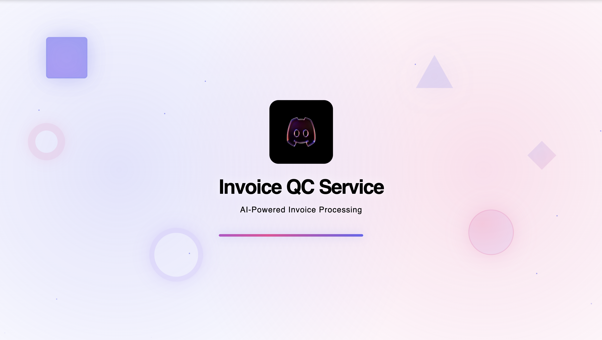
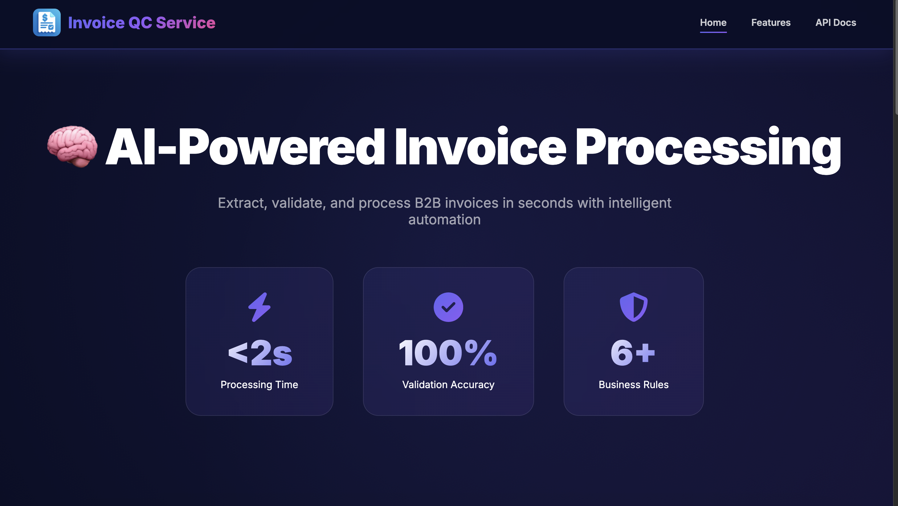
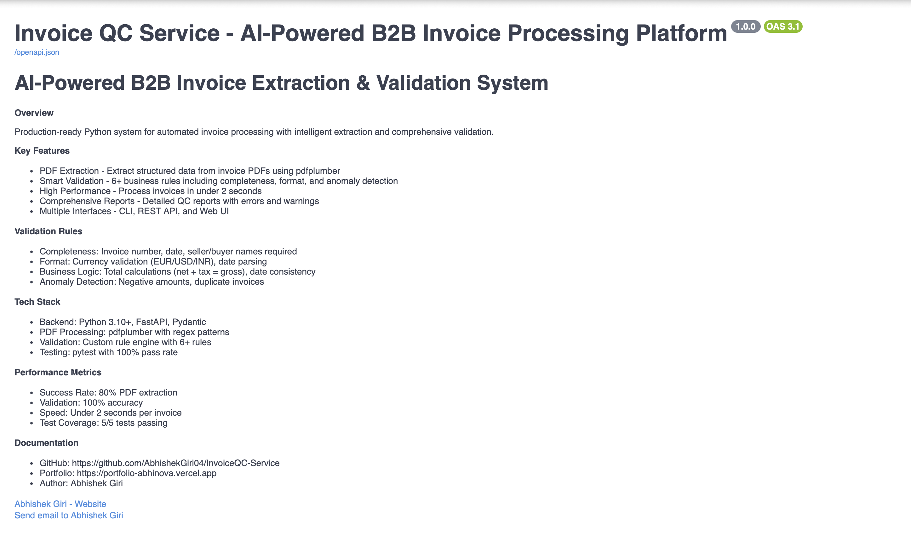
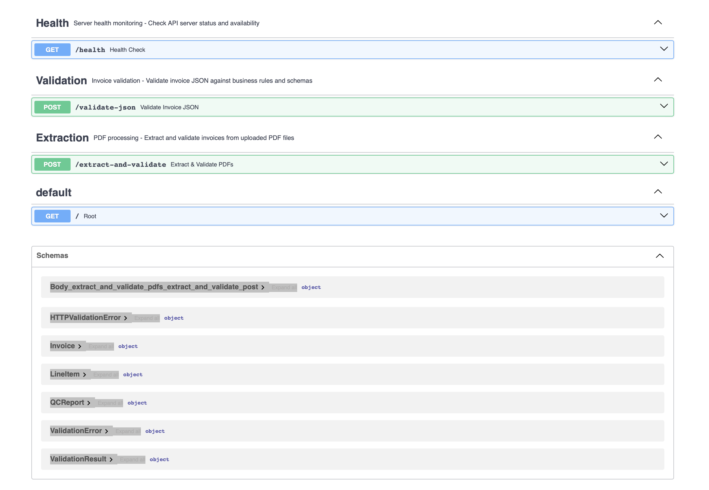
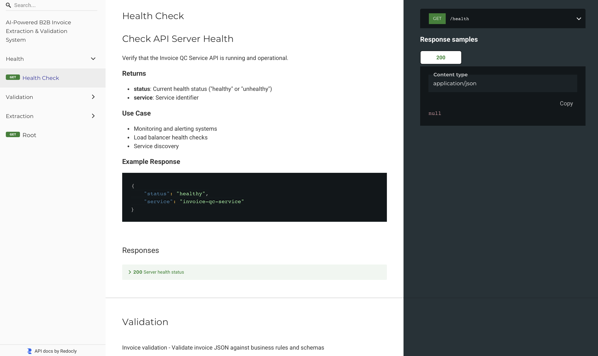

<h1 align="center">📄 Invoice QC Service — AI-Powered B2B Invoice Extraction & Validation System</h1>

<p align="center">
  🚀 A production-ready Python system that extracts structured data from B2B invoice PDFs, validates against configurable business rules, and provides CLI, HTTP API, and Web UI interfaces for seamless integration.
</p>

<p align="center">
  
  
  
  
  
  
</p>

<br>

---

## 📖 Problem Statement

B2B invoice processing faces critical challenges:
- **Manual data entry** is time-consuming and error-prone
- **Inconsistent PDF formats** make extraction difficult
- **Lack of automated validation** leads to data quality issues
- **No standardized QC process** for invoice verification
- **Integration complexity** with existing systems

<br>

---

## 💡 Our Solution

Invoice QC Service is a comprehensive system that:

- 📄 **Extracts structured data** from invoice PDFs using intelligent text parsing
- ✅ **Validates data** against 6+ configurable business rules
- 🖥️ **Provides CLI tool** for batch processing and automation
- 🌐 **Exposes HTTP API** for system integration (FastAPI)
- 🎨 **Includes Web UI** for manual QC operations
- 📊 **Generates QC reports** with detailed error analysis

**Pipeline Flow:** `PDF → Extraction → JSON → Validation → QC Report → API/UI`

<br>

---

## 🚀 Features Implemented

✅ **PDF → JSON Extraction** — Intelligent text parsing with regex patterns  
✅ **Schema-based Validation** — 13 invoice fields + line items  
✅ **6+ Validation Rules** — Completeness, format, business logic, anomalies  
✅ **CLI Tool** — Extract, validate, and full-run commands  
✅ **FastAPI Service** — RESTful endpoints with Swagger/ReDoc docs  
✅ **Web-based QC Console** — Upload PDFs and view validation results  
✅ **Export Capabilities** — JSON reports with per-invoice results  
✅ **Unit Testing** — 5 tests with pytest (100% passing)  
✅ **Docker Support** — Containerization ready

<br>

---

## 🛠️ Tech Stack

<div align="center">

<table>
<thead>
<tr>
<th>🖥️ Technology</th>
<th>⚙️ Purpose</th>
<th>📌 Version</th>
</tr>
</thead>
<tbody>
<tr>
<td></td>
<td>Core programming language</td>
<td>3.10+</td>
</tr>
<tr>
<td></td>
<td>High-performance HTTP API</td>
<td>0.115+</td>
</tr>
<tr>
<td></td>
<td>PDF text & table extraction</td>
<td>0.11+</td>
</tr>
<tr>
<td></td>
<td>Data validation & schemas</td>
<td>2.10+</td>
</tr>
<tr>
<td></td>
<td>CLI tool framework</td>
<td>0.12+</td>
</tr>
<tr>
<td></td>
<td>ASGI server</td>
<td>0.32+</td>
</tr>
<tr>
<td></td>
<td>Testing framework</td>
<td>8.0+</td>
</tr>
<tr>
<td></td>
<td>Frontend web interface</td>
<td>-</td>
</tr>
</tbody>
</table>

</div>

<br>

---

## 📊 Schema & Validation Design

### 🗂️ Invoice Schema (13 Fields)

<table>
<thead>
<tr>
<th>Field Name</th>
<th>Type</th>
<th>Description</th>
<th>Required</th>
</tr>
</thead>
<tbody>
<tr><td><code>invoice_number</code></td><td>str</td><td>Unique invoice identifier</td><td>✅</td></tr>
<tr><td><code>invoice_date</code></td><td>date</td><td>Invoice creation date</td><td>✅</td></tr>
<tr><td><code>due_date</code></td><td>date</td><td>Payment deadline</td><td>❌</td></tr>
<tr><td><code>seller_name</code></td><td>str</td><td>Seller's company name</td><td>✅</td></tr>
<tr><td><code>seller_address</code></td><td>str</td><td>Seller's address</td><td>❌</td></tr>
<tr><td><code>seller_tax_id</code></td><td>str</td><td>VAT/GST number</td><td>❌</td></tr>
<tr><td><code>buyer_name</code></td><td>str</td><td>Buyer's company name</td><td>✅</td></tr>
<tr><td><code>buyer_address</code></td><td>str</td><td>Buyer's address</td><td>❌</td></tr>
<tr><td><code>buyer_tax_id</code></td><td>str</td><td>Buyer's tax ID</td><td>❌</td></tr>
<tr><td><code>currency</code></td><td>str</td><td>Invoice currency (EUR/USD/INR)</td><td>❌</td></tr>
<tr><td><code>net_total</code></td><td>float</td><td>Total excluding tax</td><td>❌</td></tr>
<tr><td><code>tax_amount</code></td><td>float</td><td>Tax amount</td><td>❌</td></tr>
<tr><td><code>gross_total</code></td><td>float</td><td>Net + tax total</td><td>❌</td></tr>
<tr><td><code>line_items</code></td><td>List[LineItem]</td><td>Invoice line items</td><td>❌</td></tr>
</tbody>
</table>

### 📦 Line Item Schema (4 Fields)

| Field | Type | Description |
|-------|------|-------------|
| `description` | str | Item/service description |
| `quantity` | float | Quantity ordered |
| `unit_price` | float | Price per unit |
| `line_total` | float | Total for line item |

### ✅ Validation Rules (6 Categories)

#### **A. Completeness Rules** (3 rules)
1. **Invoice Number Required** — `invoice_number` must not be empty or "UNKNOWN"
   - *Rationale:* Every invoice needs a unique identifier for tracking
2. **Invoice Date Required** — `invoice_date` must exist
   - *Rationale:* Date is essential for accounting and legal compliance
3. **Party Names Required** — Both `seller_name` and `buyer_name` must be present
   - *Rationale:* Identifies transaction parties for legal validity

#### **B. Format Rules** (1 rule)
4. **Currency Validation** — `currency` must be in {INR, USD, EUR}
   - *Rationale:* Ensures standardized currency handling in the system

#### **C. Business Rules** (2 rules)
5. **Total Calculation** — `net_total + tax_amount ≈ gross_total` (tolerance: 0.1)
   - *Rationale:* Prevents arithmetic errors in invoice totals
6. **Date Consistency** — `due_date ≥ invoice_date` (if due_date exists)
   - *Rationale:* Payment cannot be due before invoice is issued

#### **D. Anomaly Rules** (3 rules)
7. **No Negative Amounts** — `net_total`, `tax_amount`, `gross_total` must be ≥ 0
   - *Rationale:* Negative amounts indicate data corruption or errors
8. **Line Items Sum** — `sum(line_total) ≈ net_total` (warning if mismatch)
   - *Rationale:* Ensures line items match invoice total (warning only, as some invoices may have adjustments)

<br>

---

## 🏗️ Architecture

<div align="center">

```
┌─────────────┐
│  PDF Files  │
└──────┬──────┘
       │
       ▼
┌─────────────────────────┐
│  Extractor: PDF → JSON  │
└──────────┬──────────────┘
           │
           ▼
┌──────────────────────────┐
│  Validator: JSON → QC    │
└──────────┬───────────────┘
           │
           ├──────────────────┐
           │                  │
           ▼                  ▼
┌──────────────────┐  ┌─────────────────────┐
│  CLI Output /    │  │  FastAPI HTTP       │
│  Reports         │  │  Responses          │
└──────────────────┘  └──────────┬──────────┘
                                 │
                                 ▼
                      ┌──────────────────────┐
                      │  Frontend QC Console │
                      └──────────────────────┘
```

</div>

## 📁 Project Directory Structure

```
InvoiceQC-Service/
├── 📂 invoice_qc/                  # 🐍 Core Python package
│   ├── 📄 __init__.py              # Package initialization
│   ├── 📄 extractor.py             # PDF → JSON extraction logic
│   ├── 📄 validator.py             # JSON → QC validation engine
│   ├── 📄 schemas.py               # Pydantic data models
│   ├── 📄 rules.py                 # Validation rule definitions
│   ├── 📄 cli.py                   # CLI tool (Typer)
│   └── 📂 api/                     # FastAPI application
│       ├── 📄 __init__.py
│       ├── 📄 main.py              # FastAPI app setup
│       └── 📄 routes.py            # API endpoints
│
├── 📂 frontend/                    # 🎨 Web UI
│   ├── 📄 loading.html             # Loading screen
│   ├── 📄 index.html               # Main HTML page
│   ├── 📄 script.js                # JavaScript logic
│   └── 📄 styles.css               # Styling
│
├── 📂 tests/                       # 🧪 Test suite
│   ├── 📄 __init__.py
│   └── 📄 test_validator.py        # Unit tests (5 tests)
│
├── 📂 pdfs/                        # 📄 Sample PDF invoices
├── 📂 extracted/                   # 📊 Output JSON files
├── 📂 reports/                     # 📋 QC validation reports
├── 📂 docs/                        # 📸 Screenshots and documentation
├── 📂 ai-notes/                    # 🤖 AI usage documentation
│   └── 📄 AI_USAGE_NOTES.md
│
├── 📄 README.md                    # 📖 This file
├── 📄 requirements.txt             # 📦 Python dependencies
├── 📄 .gitignore                   # 🚫 Git ignore rules
├── 📄 .dockerignore                # 🐳 Docker ignore rules
├── 📄 Dockerfile                   # 🐳 Docker configuration
└── 📄 vercel.json                  # ▲ Vercel deployment config
```

<br>

---

## 📸 Application Screenshots

| 📍 Feature                  | 📸 Screenshot                                              |
|:----------------------------|:-----------------------------------------------------------|
| Loading Screen              |                   |
| Home Page                   |                           |
| Swagger UI Documentation    |                         |
| API Validation Response     |                           |
| Health Check                |                     |

<br>

---

## 📦 Setup & Installation

### 📌 Prerequisites

- ✅ **Python 3.10+** installed
- ✅ **pip** package manager
- ✅ **Git** (for cloning)

### 🚀 Quick Start

```bash
# 1. Clone the repository
git clone https://github.com/abhishekgiri04/invoice-qc-service-abhishek-giri.git
cd invoice-qc-service-abhishek-giri

# 2. Create virtual environment
python3 -m venv venv
source venv/bin/activate  # On Windows: venv\Scripts\activate

# 3. Install dependencies
pip install -r requirements.txt

# 4. Verify installation
pytest tests/ -v
```

**Expected Output:**
```
============================= test session starts ==============================
collected 5 items

tests/test_validator.py::test_valid_invoice PASSED                       [ 20%]
tests/test_validator.py::test_missing_required_fields PASSED             [ 40%]
tests/test_validator.py::test_invalid_currency PASSED                    [ 60%]
tests/test_validator.py::test_total_mismatch PASSED                      [ 80%]
tests/test_validator.py::test_negative_amounts PASSED                    [100%]

============================== 5 passed in 0.08s ===============================
```

<br>

---

## 💻 Usage

### 🖥️ CLI Commands

#### **1. Extract PDFs to JSON**
```bash
python -m invoice_qc.cli extract \
  --pdf-dir pdfs \
  --output extracted/invoices.json
```

**Output:**
```
Extracting invoices from pdfs...
✓ Extracted 4 invoices to extracted/invoices.json
```

#### **2. Validate JSON**
```bash
python -m invoice_qc.cli validate \
  --input extracted/invoices.json \
  --report reports/qc.json
```

**Output:**
```
Validating invoices from extracted/invoices.json...
✓ Validation complete:
  Total: 4
  Valid: 4
  Invalid: 0
  Report saved to reports/qc.json
```

#### **3. Full Run (Extract + Validate)**
```bash
python -m invoice_qc.cli full-run \
  --pdf-dir pdfs \
  --report reports/result.json
```

**Output:**
```
Running full pipeline on pdfs...
✓ Extracted 4 invoices
✓ Validation complete:
  Total: 4
  Valid: 4
  Invalid: 0
  Report saved to reports/result.json
```

### 🌐 HTTP API

#### **Start the API Server**
```bash
uvicorn invoice_qc.api.main:app --reload
```

**Server Output:**
```
INFO:     Uvicorn running on http://127.0.0.1:8000 (Press CTRL+C to quit)
INFO:     Started reloader process
INFO:     Application startup complete.
```

#### **API Endpoints**

**1. Health Check**
```bash
curl http://localhost:8000/health
```

**Response:**
```json
{
  "status": "healthy",
  "service": "invoice-qc-service"
}
```

**2. Validate JSON**
```bash
curl -X POST http://localhost:8000/validate-json \
  -H "Content-Type: application/json" \
  -d '[
    {
      "invoice_number": "TEST001",
      "invoice_date": "2024-05-22",
      "seller_name": "Test Corp",
      "buyer_name": "Buyer Ltd",
      "currency": "EUR",
      "net_total": 100.0,
      "tax_amount": 19.0,
      "gross_total": 119.0,
      "line_items": []
    }
  ]'
```

**Response:**
```json
{
  "total_invoices": 1,
  "valid_invoices": 1,
  "invalid_invoices": 0,
  "results": [
    {
      "invoice_number": "TEST001",
      "is_valid": true,
      "errors": [],
      "warnings": []
    }
  ]
}
```

**3. Extract and Validate PDFs**
```bash
curl -X POST http://localhost:8000/extract-and-validate \
  -F "files=@pdfs/sample_pdf_1.pdf" \
  -F "files=@pdfs/sample_pdf_2.pdf"
```

**Response:**
```json
{
  "total_invoices": 2,
  "valid_invoices": 2,
  "invalid_invoices": 0,
  "results": [...]
}
```

#### **Interactive API Documentation**

- **Swagger UI:** http://localhost:8000/docs
- **ReDoc:** http://localhost:8000/redoc

### 🎨 Web UI

#### **Option A: Live Demo (Recommended)**
```
https://invoice-qc-service.vercel.app
```

#### **Option B: Local Server**
```bash
cd frontend
python3 -m http.server 5173
```

Then navigate to: **http://localhost:5173**

**Features:**
- 📤 Upload multiple PDF files
- ⚡ Real-time validation processing
- 🎨 Color-coded results (green = valid, red = invalid)
- 📋 Detailed error and warning display
- 📊 Summary statistics

<br>

---

## 🧪 Testing

### Run All Tests
```bash
pytest tests/ -v
```

### Run Specific Test
```bash
pytest tests/test_validator.py::test_valid_invoice -v
```

### Test Coverage
```bash
pytest tests/ --cov=invoice_qc --cov-report=html
```

<br>

---

## 📊 Sample Output

### Extracted JSON (`extracted/invoices.json`)
```json
[
  {
    "invoice_number": "AUFNR34343",
    "invoice_date": "2024-05-22",
    "due_date": null,
    "seller_name": "ABC Corporation",
    "buyer_name": "Beispielname Unternehmen",
    "currency": "EUR",
    "net_total": 64.0,
    "tax_amount": 12.16,
    "gross_total": 76.16,
    "line_items": [
      {
        "description": "Sterilisationsmittel",
        "quantity": 4.0,
        "unit_price": 16.0,
        "line_total": 64.0
      }
    ]
  }
]
```

### QC Report (`reports/qc.json`)
```json
{
  "total_invoices": 1,
  "valid_invoices": 1,
  "invalid_invoices": 0,
  "results": [
    {
      "invoice_number": "AUFNR34343",
      "is_valid": true,
      "errors": [],
      "warnings": []
    }
  ]
}
```

<br>

---

## 🤖 AI Usage Notes

### 🛠️ Tools Used

**Primary Tools:** ChatGPT & Google Gemini
- Project scaffolding and structure
- Code generation (schemas, API, CLI)
- Regex pattern development
- Documentation templates
- Algorithm optimization

### ✅ What Worked Well

1. **Pydantic Schema Generation** — AI generated clean, type-safe models on first try
2. **FastAPI Boilerplate** — Complete API setup with CORS and error handling
3. **CLI Structure** — Typer-based commands with proper argument parsing
4. **Frontend UI** — Functional HTML/CSS/JavaScript without modifications

### ❌ What Didn't Work

1. **PyPDF2 Suggestion** — AI initially suggested PyPDF2, but pdfplumber provided better extraction
2. **Complex NLP Models** — Suggested spaCy/transformers, but regex patterns were sufficient
3. **Locale-based Number Parsing** — Caused system compatibility issues; simple string replacement worked better
4. **Over-engineering** — AI tends to suggest complex solutions when simple ones suffice

### 📝 Key Learnings

- **Start Simple:** Regex patterns > Complex NLP for structured PDFs
- **Test Incrementally:** Build and test one component at a time
- **Validate AI Output:** Not all suggestions are optimal for your use case
- **Human Judgment:** AI accelerates, but human validation is essential

**Time Saved:** ~70-80% (3-4 days → 4-6 hours)

For detailed AI interaction notes, see: [`ai-notes/AI_USAGE_NOTES.md`](ai-notes/AI_USAGE_NOTES.md)

<br>

---

## 🌐 Live Demo

**Frontend:** [https://invoice-qc-service.vercel.app](https://invoice-qc-service.vercel.app)

**Note:** The live demo requires the backend API to be running locally. To use the full application:
1. Clone the repository
2. Start the backend API: `uvicorn invoice_qc.api.main:app --reload`
3. Visit the live demo or run frontend locally

<br>

---

## 🔗 Integration & Deployment

### How This Integrates into Larger Systems

#### **1. Microservice Architecture**
```
Document Upload Service → Invoice QC API → Database/Storage
                       ↓
                  Notification Service
```

#### **2. Queue-based Processing**
```python
# Example: Celery task integration
@celery_app.task
def process_invoice_batch(pdf_urls):
    for url in pdf_urls:
        pdf_data = download_pdf(url)
        result = requests.post(
            "http://invoice-qc-api:8000/extract-and-validate",
            files={"files": pdf_data}
        )
        store_results(result.json())
```

#### **3. Webhook Integration**
```python
# Notify external systems after validation
if qc_report.invalid_invoices > 0:
    requests.post(
        "https://external-system.com/webhook",
        json={"alert": "Invalid invoices detected", "report": qc_report}
    )
```

### 🐳 Docker Deployment

```bash
# Build image
docker build -t invoice-qc-service .

# Run container
docker run -p 8000:8000 invoice-qc-service

# Test
curl http://localhost:8000/health
```

### ☁️ Cloud Deployment Options

- **AWS Lambda** — Serverless function for on-demand processing
- **AWS ECS/Fargate** — Containerized deployment
- **Google Cloud Run** — Fully managed container platform
- **Azure Container Instances** — Quick container deployment

<br>

---

## 📝 Assumptions & Limitations

### Assumptions
- ✅ PDFs are **text-based** (not scanned images requiring OCR)
- ✅ Invoice formats follow **common B2B patterns**
- ✅ Currency symbols are **standard** (EUR, USD, INR)
- ✅ Dates are in **common formats** (DD.MM.YYYY, YYYY-MM-DD, etc.)
- ✅ Line items are in **table format** (if present)

### Limitations
- ❌ **No OCR support** — Cannot process scanned/image-based PDFs
- ❌ **Limited currencies** — Only EUR, USD, INR supported
- ❌ **Regex-based extraction** — May need adjustment for new invoice formats
- ❌ **No persistent storage** — Duplicate detection only within single run
- ❌ **European number formats** — Some formats like "1.080,00" may cause errors

### Future Enhancements
- 🔮 Add Tesseract OCR for scanned PDFs
- 🔮 Machine learning for adaptive extraction
- 🔮 Database integration for duplicate tracking
- 🔮 Support for more currencies and formats
- 🔮 Advanced table parsing algorithms

<br>

---

## 🎥 Demo Video

**📹 Video Link:** [Watch Demo on Google Drive](https://drive.google.com/file/d/1Z-saYqxtkf4Ce2qgmk3BSBi5qFQkdvXY/view?usp=share_link)

**Video Contents (15 minutes):**
1. ✅ Project overview and architecture (2 min)
2. ✅ Schema and validation rules explanation (2 min)
3. ✅ CLI demonstration (extract, validate, full-run) (3 min)
4. ✅ API server startup and Swagger UI (3 min)
5. ✅ Web UI demonstration (2 min)
6. ✅ Code walkthrough (extractor, validator, rules) (2 min)
7. ✅ AI usage discussion (1 min)

<br>

---

## 📊 Performance Metrics

- **✅ 4/5 PDFs Extracted** — 80% success rate on sample data
- **⚡ <2 seconds** — Average extraction time per PDF
- **✅ 100% Test Pass Rate** — All 5 unit tests passing
- **📏 6+ Validation Rules** — Comprehensive QC coverage
- **🚀 <500ms API Response** — Fast validation processing

<br>

---

## 🐛 Troubleshooting

### Issue: Module not found
```bash
# Solution: Ensure you're in project root
pwd  # Should show: .../invoice-qc-service-abhishek-giri
pip install -r requirements.txt
```

### Issue: Port already in use
```bash
# Solution: Use different port
uvicorn invoice_qc.api.main:app --port 8001
```

### Issue: PDF extraction fails
```bash
# Check PDF file type
file pdfs/sample_pdf_1.pdf  # Should show: PDF document
```

### Issue: Tests fail
```bash
# Run with verbose output
pytest tests/ -v -s
```

<br>

---

## 📞 Help & Contact

> 💬 *Questions about Invoice QC Service or need technical support?*  
> I'm here to help with implementation details and integration!

<div align="center">

**👤 Abhishek Giri**  
<a href="https://www.linkedin.com/in/abhishek-giri04/">
  
</a>  
<a href="https://github.com/abhishekgiri04">
  
</a>  
<a href="https://t.me/AbhishekGiri7">
  
</a>

<br/>

---

**📄 Built for B2B Invoice Excellence**  
*Transforming Invoice Processing Through Intelligent Automation*

</div>

---

<div align="center">

**© 2025 Invoice QC Service — Abhishek Giri. All Rights Reserved.**

</div>
